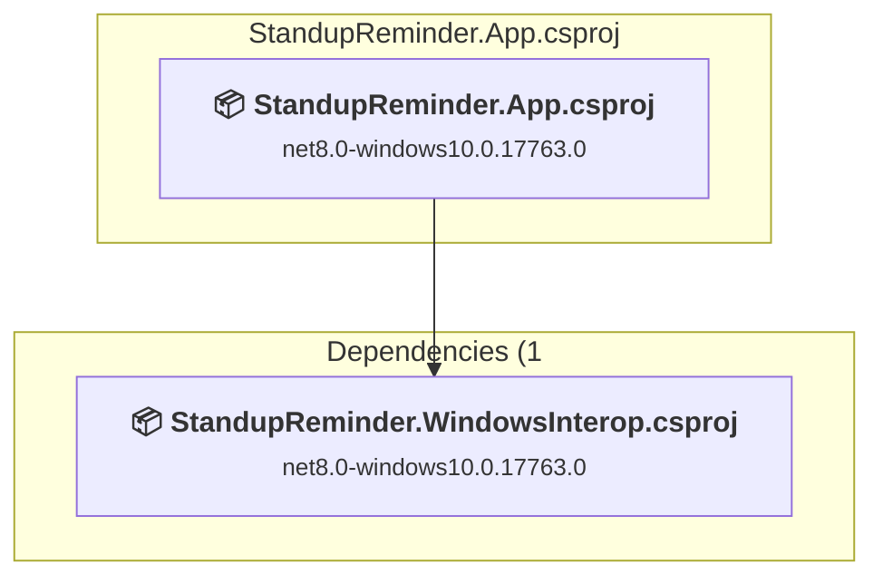
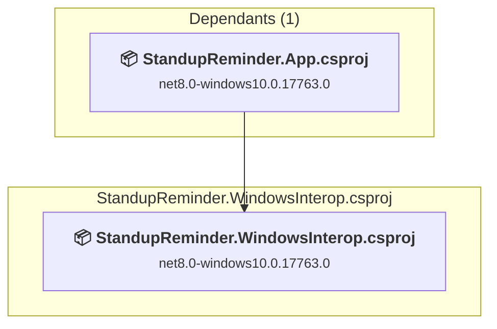

# Projects and dependencies analysis

This document provides a comprehensive overview of the projects and their dependencies in the context of upgrading to .NETCoreApp,Version=v10.0.

## Table of Contents

- [Executive Summary](#executive-Summary)
  - [Highlevel Metrics](#highlevel-metrics)
  - [Projects Compatibility](#projects-compatibility)
  - [Package Compatibility](#package-compatibility)
  - [API Compatibility](#api-compatibility)
- [Aggregate NuGet packages details](#aggregate-nuget-packages-details)
- [Top API Migration Challenges](#top-api-migration-challenges)
  - [Technologies and Features](#technologies-and-features)
  - [Most Frequent API Issues](#most-frequent-api-issues)
- [Projects Relationship Graph](#projects-relationship-graph)
- [Project Details](#project-details)

  - [StandupReminder.App\StandupReminder.App.csproj](#standupreminderappstandupreminderappcsproj)
  - [StandupReminder.WindowsInterop\StandupReminder.WindowsInterop.csproj](#standupreminderwindowsinteropstandupreminderwindowsinteropcsproj)

## Executive Summary

### Highlevel Metrics

| Metric | Count | Status |
| :--- | :---: | :--- |
| Total Projects | 2 | All require upgrade |
| Total NuGet Packages | 2 | 1 need upgrade |
| Total Code Files | 33 |  |
| Total Code Files with Incidents | 19 |  |
| Total Lines of Code | 2533 |  |
| Total Number of Issues | 468 |  |
| Estimated LOC to modify | 465+ | at least 18.4% of codebase |

### Projects Compatibility

| Project | Target Framework | Difficulty | Package Issues | API Issues | Est. LOC Impact | Description |
| :--- | :---: | :---: | :---: | :---: | :---: | :--- |
| [StandupReminder.App\StandupReminder.App.csproj](#standupreminderappstandupreminderappcsproj) | net8.0-windows10.0.17763.0 | 🟡 Medium | 1 | 449 | 449+ | Wpf, Sdk Style = True |
| [StandupReminder.WindowsInterop\StandupReminder.WindowsInterop.csproj](#standupreminderwindowsinteropstandupreminderwindowsinteropcsproj) | net8.0-windows10.0.17763.0 | 🟢 Low | 0 | 16 | 16+ | Wpf, Sdk Style = True |

### Package Compatibility

| Status | Count | Percentage |
| :--- | :---: | :---: |
| ✅ Compatible | 1 | 50.0% |
| ⚠️ Incompatible | 1 | 50.0% |
| 🔄 Upgrade Recommended | 0 | 0.0% |
| ***Total NuGet Packages*** | ***2*** | ***100%*** |

### API Compatibility

| Category | Count | Impact |
| :--- | :---: | :--- |
| 🔴 Binary Incompatible | 432 | High - Require code changes |
| 🟡 Source Incompatible | 19 | Medium - Needs re-compilation and potential conflicting API error fixing |
| 🔵 Behavioral change | 14 | Low - Behavioral changes that may require testing at runtime |
| ✅ Compatible | 3797 |  |
| ***Total APIs Analyzed*** | ***4262*** |  |

## Aggregate NuGet packages details

| Package | Current Version | Suggested Version | Projects | Description |
| :--- | :---: | :---: | :--- | :--- |
| Microsoft.Toolkit.Uwp.Notifications | 7.1.3 |  | [StandupReminder.App.csproj](#standupreminderappstandupreminderappcsproj) | ✅Compatible |
| WPF-UI | 4.2.0 | 2.0.3 | [StandupReminder.App.csproj](#standupreminderappstandupreminderappcsproj) | ⚠️NuGet package is incompatible |

## Top API Migration Challenges

### Technologies and Features

| Technology | Issues | Percentage | Migration Path |
| :--- | :---: | :---: | :--- |
| WPF (Windows Presentation Foundation) | 184 | 39.6% | WPF APIs for building Windows desktop applications with XAML-based UI that are available in .NET on Windows. WPF provides rich desktop UI capabilities with data binding and styling. Enable Windows Desktop support: Option 1 (Recommended): Target net9.0-windows; Option 2: Add <UseWindowsDesktop>true</UseWindowsDesktop>. |
| Windows Forms | 119 | 25.6% | Windows Forms APIs for building Windows desktop applications with traditional Forms-based UI that are available in .NET on Windows. Enable Windows Desktop support: Option 1 (Recommended): Target net9.0-windows; Option 2: Add <UseWindowsDesktop>true</UseWindowsDesktop>; Option 3 (Legacy): Use Microsoft.NET.Sdk.WindowsDesktop SDK. |
| GDI+ / System.Drawing | 11 | 2.4% | System.Drawing APIs for 2D graphics, imaging, and printing that are available via NuGet package System.Drawing.Common. Note: Not recommended for server scenarios due to Windows dependencies; consider cross-platform alternatives like SkiaSharp or ImageSharp for new code. |
| Windows Forms Legacy Controls | 2 | 0.4% | Legacy Windows Forms controls that have been removed from .NET Core/5+ including StatusBar, DataGrid, ContextMenu, MainMenu, MenuItem, and ToolBar. These controls were replaced by more modern alternatives. Use ToolStrip, MenuStrip, ContextMenuStrip, and DataGridView instead. |

### Most Frequent API Issues

| API | Count | Percentage | Category |
| :--- | :---: | :---: | :--- |
| T:System.Windows.Controls.Slider | 20 | 4.3% | Binary Incompatible |
| T:System.Windows.Forms.ContextMenuStrip | 18 | 3.9% | Binary Incompatible |
| T:System.Windows.Threading.DispatcherTimer | 15 | 3.2% | Binary Incompatible |
| T:System.Windows.Forms.NotifyIcon | 15 | 3.2% | Binary Incompatible |
| T:System.Windows.RoutedEventHandler | 10 | 2.2% | Binary Incompatible |
| T:System.Windows.Media.Color | 10 | 2.2% | Binary Incompatible |
| T:System.Uri | 8 | 1.7% | Behavioral Change |
| T:System.Drawing.Icon | 8 | 1.7% | Source Incompatible |
| T:System.Windows.Forms.ToolStripMenuItem | 8 | 1.7% | Binary Incompatible |
| T:System.Windows.Forms.ToolStripItemCollection | 8 | 1.7% | Binary Incompatible |
| P:System.Windows.Forms.ToolStrip.Items | 8 | 1.7% | Binary Incompatible |
| M:System.Windows.Window.Close | 8 | 1.7% | Binary Incompatible |
| P:System.Windows.Controls.Primitives.RangeBase.Value | 8 | 1.7% | Binary Incompatible |
| T:System.Windows.Controls.Border | 7 | 1.5% | Binary Incompatible |
| P:System.Windows.Controls.TextBox.Text | 7 | 1.5% | Binary Incompatible |
| T:System.Windows.Application | 6 | 1.3% | Binary Incompatible |
| M:System.TimeSpan.FromMinutes(System.Double) | 6 | 1.3% | Source Incompatible |
| T:System.Windows.Forms.ToolStripItem | 6 | 1.3% | Binary Incompatible |
| M:System.Windows.Forms.ToolStripItemCollection.Add(System.String,System.Drawing.Image,System.EventHandler) | 6 | 1.3% | Binary Incompatible |
| T:System.Windows.Input.Key | 6 | 1.3% | Binary Incompatible |
| T:System.Windows.Window | 6 | 1.3% | Binary Incompatible |
| T:System.Windows.WindowState | 6 | 1.3% | Binary Incompatible |
| T:System.Windows.Interop.HwndSource | 6 | 1.3% | Binary Incompatible |
| M:System.Windows.Application.LoadComponent(System.Object,System.Uri) | 5 | 1.1% | Binary Incompatible |
| M:System.Uri.#ctor(System.String,System.UriKind) | 5 | 1.1% | Behavioral Change |
| M:System.Windows.Window.Activate | 5 | 1.1% | Binary Incompatible |
| M:System.Windows.Window.Show | 5 | 1.1% | Binary Incompatible |
| E:System.Windows.Controls.Primitives.ButtonBase.Click | 5 | 1.1% | Binary Incompatible |
| T:System.Windows.RoutedEventArgs | 5 | 1.1% | Binary Incompatible |
| T:System.Windows.Media.SolidColorBrush | 5 | 1.1% | Binary Incompatible |
| T:System.Windows.Markup.IComponentConnector | 4 | 0.9% | Binary Incompatible |
| M:System.Windows.Threading.DispatcherTimer.Stop | 4 | 0.9% | Binary Incompatible |
| T:System.Windows.Threading.DispatcherPriority | 4 | 0.9% | Binary Incompatible |
| P:System.Windows.Forms.NotifyIcon.Visible | 4 | 0.9% | Binary Incompatible |
| T:System.Windows.Forms.MouseEventHandler | 4 | 0.9% | Binary Incompatible |
| T:System.Windows.Input.KeyEventHandler | 4 | 0.9% | Binary Incompatible |
| E:System.Windows.Window.Closing | 4 | 0.9% | Binary Incompatible |
| E:System.Windows.Controls.Primitives.RangeBase.ValueChanged | 4 | 0.9% | Binary Incompatible |
| P:System.Windows.FrameworkElement.DataContext | 4 | 0.9% | Binary Incompatible |
| T:System.Windows.DependencyProperty | 3 | 0.6% | Binary Incompatible |
| E:System.Windows.Window.Closed | 3 | 0.6% | Binary Incompatible |
| M:System.Windows.Threading.DispatcherTimer.Start | 3 | 0.6% | Binary Incompatible |
| E:System.Windows.Threading.DispatcherTimer.Tick | 3 | 0.6% | Binary Incompatible |
| T:System.Windows.Forms.MouseButtons | 3 | 0.6% | Binary Incompatible |
| P:System.Windows.Forms.NotifyIcon.Text | 3 | 0.6% | Binary Incompatible |
| T:System.Windows.Forms.ToolTipIcon | 3 | 0.6% | Binary Incompatible |
| T:System.Windows.Controls.TextBlock | 3 | 0.6% | Binary Incompatible |
| T:System.Windows.Input.ModifierKeys | 3 | 0.6% | Binary Incompatible |
| T:System.Windows.Media.Brush | 3 | 0.6% | Binary Incompatible |
| P:System.Windows.Controls.Border.Background | 3 | 0.6% | Binary Incompatible |

## Projects Relationship Graph

Legend:
📦 SDK-style project
⚙️ Classic project

## Project Details

### StandupReminder.App\StandupReminder.App.csproj

#### Project Info

- **Current Target Framework:** net8.0-windows10.0.17763.0
- **Proposed Target Framework:** net10.0-windows
- **SDK-style**: True
- **Project Kind:** Wpf
- **Dependencies**: 1
- **Dependants**: 0
- **Number of Files**: 29
- **Number of Files with Incidents**: 17
- **Lines of Code**: 2326
- **Estimated LOC to modify**: 449+ (at least 19.3% of the project)

#### Dependency Graph

Legend:
📦 SDK-style project
⚙️ Classic project

### API Compatibility

| Category | Count | Impact |
| :--- | :---: | :--- |
| 🔴 Binary Incompatible | 416 | High - Require code changes |
| 🟡 Source Incompatible | 19 | Medium - Needs re-compilation and potential conflicting API error fixing |
| 🔵 Behavioral change | 14 | Low - Behavioral changes that may require testing at runtime |
| ✅ Compatible | 3579 |  |
| ***Total APIs Analyzed*** | ***4028*** |  |

#### Project Technologies and Features

| Technology | Issues | Percentage | Migration Path |
| :--- | :---: | :---: | :--- |
| GDI+ / System.Drawing | 11 | 2.4% | System.Drawing APIs for 2D graphics, imaging, and printing that are available via NuGet package System.Drawing.Common. Note: Not recommended for server scenarios due to Windows dependencies; consider cross-platform alternatives like SkiaSharp or ImageSharp for new code. |
| Windows Forms Legacy Controls | 2 | 0.4% | Legacy Windows Forms controls that have been removed from .NET Core/5+ including StatusBar, DataGrid, ContextMenu, MainMenu, MenuItem, and ToolBar. These controls were replaced by more modern alternatives. Use ToolStrip, MenuStrip, ContextMenuStrip, and DataGridView instead. |
| Windows Forms | 119 | 26.5% | Windows Forms APIs for building Windows desktop applications with traditional Forms-based UI that are available in .NET on Windows. Enable Windows Desktop support: Option 1 (Recommended): Target net9.0-windows; Option 2: Add <UseWindowsDesktop>true</UseWindowsDesktop>; Option 3 (Legacy): Use Microsoft.NET.Sdk.WindowsDesktop SDK. |
| WPF (Windows Presentation Foundation) | 173 | 38.5% | WPF APIs for building Windows desktop applications with XAML-based UI that are available in .NET on Windows. WPF provides rich desktop UI capabilities with data binding and styling. Enable Windows Desktop support: Option 1 (Recommended): Target net9.0-windows; Option 2: Add <UseWindowsDesktop>true</UseWindowsDesktop>. |

### StandupReminder.WindowsInterop\StandupReminder.WindowsInterop.csproj

#### Project Info

- **Current Target Framework:** net8.0-windows10.0.17763.0
- **Proposed Target Framework:** net10.0-windows
- **SDK-style**: True
- **Project Kind:** Wpf
- **Dependencies**: 0
- **Dependants**: 1
- **Number of Files**: 5
- **Number of Files with Incidents**: 2
- **Lines of Code**: 207
- **Estimated LOC to modify**: 16+ (at least 7.7% of the project)

#### Dependency Graph

Legend:
📦 SDK-style project
⚙️ Classic project

### API Compatibility

| Category | Count | Impact |
| :--- | :---: | :--- |
| 🔴 Binary Incompatible | 16 | High - Require code changes |
| 🟡 Source Incompatible | 0 | Medium - Needs re-compilation and potential conflicting API error fixing |
| 🔵 Behavioral change | 0 | Low - Behavioral changes that may require testing at runtime |
| ✅ Compatible | 218 |  |
| ***Total APIs Analyzed*** | ***234*** |  |

#### Project Technologies and Features

| Technology | Issues | Percentage | Migration Path |
| :--- | :---: | :---: | :--- |
| WPF (Windows Presentation Foundation) | 11 | 68.8% | WPF APIs for building Windows desktop applications with XAML-based UI that are available in .NET on Windows. WPF provides rich desktop UI capabilities with data binding and styling. Enable Windows Desktop support: Option 1 (Recommended): Target net9.0-windows; Option 2: Add <UseWindowsDesktop>true</UseWindowsDesktop>. |

